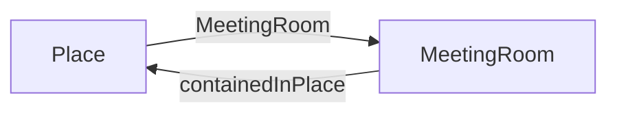

# Checks

Liste aller möglichen Checks

* Prüfe ob URL funktioniert --> CheckUrlValid
* Prüfe ob CheckOpeningHoursSpecification ausgefüllt oder leer --> CheckOpeningHoursSpecificationExist
* Prüft ob MeetingRooms mit Location via containedInPlace ist oder nicht --> CheckMeetingRoomExistAssociationContainedInPlace

## Allgemein

### CheckUrl

* CheckUrlExist --> prüft ob das Objekt eine url (code: url) hinterlegt ist
* CheckUrlValid --> prüft ob die Url des Objekt gültig ist. (Ob eine Webseite existiert und keinen Fehler (Not found) zurück gibt.)

Prüft ob die URL / Domain funktioniert

Attribut-Code: ```url```

Schedule: täglich / wöchentlich


### CheckOpeningHoursSpecification

* CheckOpeningHoursSpecificationExist
* CheckOpeningHoursSpecificationCompareUrl --> prüft ob die Öffnungszeiten des Objekts mit den Öffnungszeiten auf der Webseite (url) gleich sind.

Prüft und vergleicht Öffnungszeiten eines Objekts im Contentdesk mit den Öffnungszeiten auf der Webseite.
Mit unterstützung von AI (OpenAI).

Attribut-Code: ```openingHoursSpecification```

Schedule: manuell

## MeetingRooms

### CheckMeetingRoomExistAssociationContainedInPlace

Prüft beim Typ MeetingRoom ob beim Verbindungs-Typ "containedInPlace" ein Objekt gepflegt ist.

association-type: ```containedInPlace```

Schedule: täglich / wöchentlich

--> Back Check von CheckExistMeetingRoom

### CheckMeetingRoomWithoutAssociationContainedInPlace

Prüft und listet alle MeetingRooms die kleine Verbindung zu einer Locations (Place) via Verbindungs-Typ "containedInPlace" haben.

association-type: ```containedInPlace```

Schedule: täglich / wöchentlich




## Place

### CheckExistMeetingRoom

Listet alle Place-Objekte auf welche mindesten ein oder mehrere Objekt bei der Verbindung "MeetingRoom" gepflegt haben.
Voraussetzung / Basis für [CheckExistcontainedInPlace](#CheckExistcontainedInPlace)

association-type: ```MeetingRoom```

Schedule: täglich / wöchentlich